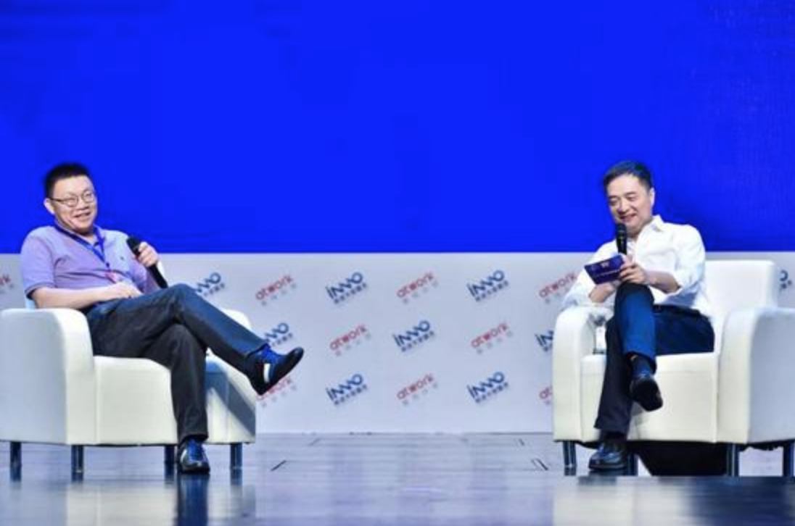
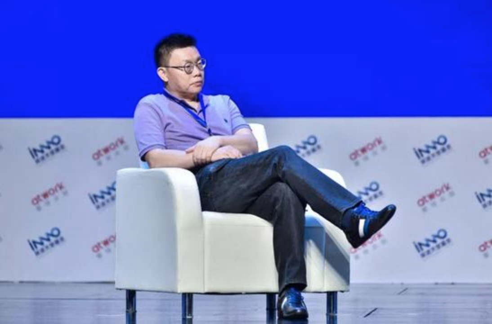

>  2018英诺创新者大会暨英诺五周年年会”，英诺天使基金创始合伙人李竹以「千亿公司是怎么炼成的」为主题对话龚虹嘉

##### 李竹：
我们今天讨论的主要话题是“**千亿公司是怎么炼成的**”。在海康威视的发展过程当中，龚总不仅是投资人，也花费了很多的心力，所以今天我准备了十个问题，来个“李竹十问”。龚总，**海康威视是最经典的案例，给您带来非常丰厚的回报，当时您看重哪一点，我们当时说不投了，您还要投呢？**
##### 龚虹嘉：
开始投资之所以说是靠情怀，主要因为都是同学，觉得如果给他投资一点钱能够改变他，也许可以改变他的命运。
##### 李竹：
龚总还是有一点情怀的，希望投一点钱能改变同学成长的路径，因为他们是在国有企业，国有企业的机制各方面没有那么好，他们要成立一个专门的公司，有一点民营的机制，龚总就投资了，所以（他）首先是有一颗善良的心。

龚总其实是一个比较简单的人，用这种善良看待这个项目。我记得签约那天，当时正好在他们的办公室，龚总说：“你们真不投啊？那我就投了。”然后把协议用传真发给了杭州，投资了海康威视，我们也就错过了几百个亿。

##### 龚虹嘉：
因为在我的心里，在我人生的经历里，有一点痕迹很重，就是老爱叫板，你们说不行我就偏投，所以就激发我们一定要投这个项目。

##### 李竹：

我一直说龚总是一个特立独行的人，他的思考方式跟别人不一样，他可能左右大脑跟我们结构不太一样，所以想成功就不能跟大家都一样。

**第二个问题是，海康威视到IPO之前从来没有融过资，这是一个非常独特的现象，为什么会是这样的情况？我记得当时你也做过努力，想帮他们融资？**

##### 龚虹嘉：
公司成立时，大家约定，我主要的工作之一是为公司引入投资。公司成立前三年，我选定的投资机构，他们都会投赞成票。也谈了不少机构，但是看了公司股权结构、业务规模，都没有投，从专业的角度，各有各的原因，最后都没有投成。

##### 李竹：
创业者没有股份的公司，最后居然能有这么大的成功。

##### 龚虹嘉：
当时我找了国内最有名的VC。他说龚总我给你算一个数字，他估算了下全国在2000年时候安防领域的市场规模，大概也就是6亿人民币。他让我们投资这么小的一个市场，那不是脑袋有问题吗？我可能数学不够好，没有做这种判断，要不我当年也考上清华，而不是华中科大了。

##### 李竹：
海康威视确实碰到过很多的困难，我记得当时包括做广电总局那一单的时候流动资金很紧，主要成功的原因来自于团队还是市场发生变化，又或是什么其他的东西，从你的角度看什么因素是最重要的？

##### 龚虹嘉：
大家说因为这个公司的出身结构比较怪异，背景比较怪异，在那个年代，国有股东是被社会上所鄙视的，国有企业就意味着效率低下，意味着人心涣散，意味着出工不出力，2000年初的时候大众对国有就是这么一个印象。

所以我们从那一刻开始，就知道这个公司一定要尽快赚钱，因为烧不起钱。

当时竹总也给我们介绍了一单广电的生意，对全中国所有的电视台正在做播放的节目做监控，当时我想，全世界做不到，也许我们可以，竹总把这个项目推荐给我们，这个公司第一年就挣钱了。

等到第三年的时候，我们已经有2000—3000万元的纯利润了。这三年里没有融到钱，到一年赚几千万利润的时候，国有股东不会同意你再融钱来稀释他的股权，所以这个公司一直靠自己来发展。当然这个行业在2005年以后成长很快，一直到现在，这个行业的价值还在不断增长。

从VC那里拿钱最多的都是跟人工智能、深度学习相关的公司，最后这些公司拿到超过十亿的融资以后，基本上都会把他们的梦想、落地点和突破口放在安防。

##### 李竹：
当时我们其实没有投Face++就是担心他打不过，没想到现在做得很好。

##### 龚虹嘉：
**跟视频分析相关的内涵不断扩大，导致海康威视在每个正确的时点都做出了正确的选择，这个非常重要。**

昨晚，正好我在微信上回答他们昨天刷屏的“你的成功其实跟你没有多大关系，跟你所处的时代有关系”。他们举了电梯的例子，几个清华、北大的学生在电梯里做仰卧起坐，最后电梯把他们载到了108层，大家认为这些人是装逼。

网上有很多这样附和的声音，昨天半夜，我告诉大家一句话，**实际上人生也好，成长也好，创业也好，在很多你看到的变化面前，实际上你最关键需要做的是选择，如果选择错误就不能换来好的结果。**

**有些人的坚持得到了好结果，是因为在坚持的过程当中，不断调整和修正自己的选择，最后让自己做出了在后来那个时点看正确的选择，所以选择非常重要。**

海康威视就是这样，在每个时点一定要走进正确的、你应该进的那个“电梯”，这个非常重要。所以我想，海康威视的创始人既有非常强的自信能力又有很好的格局观，又有很好的知觉和预见的能力。

双鱼座就是具备这种过人的直觉，使他在每个关键节点能做出正确选择，然后不断用骄人的业绩证明自己。

海康威视是从成立至今，每年的利润和营收增长都在40%以上，这个是非常少见的。在A股上市公司里应该也是绝无仅有的。

这样的话，让国有股东，当然也包括我这样的二股东，愿意给予经营层充分的信任，让大家彼此成为竹总说的“互相欣赏的人”。

互相欣赏换来的就是信任，欣赏也是一种爱，爱的力量是很强大的，这样公司就发展的越来越好，盈利能力越来越强，所以一直也没有融资。这应该也是国内VC不太愿意宣传的一个案子，就是没有VC参与，创业也可以成功，这是VC不愿意听到的。

##### 李竹：
龚总其实也回答了另外一个问题，**海康威视的传奇能不能复制？** 首先是不是双鱼座，另外一个确实还是要有韧劲、坚持，随市场而动。您也是市场的LP，一直还在做，自己也在做早期投资，那么您现在投一些什么方向？为什么要投这些方向？

##### 龚虹嘉：
海康威视成功以后，雷军说：我是谁，我在为什么而奋斗？我想人也是这样，当自己的财富到了一定的阶段的时候，就像一个企业达到一定程度的时候，就会思考更多的东西。思考的过程中，就需要回答竹总刚才说的类似这样想成为谁，准备去向哪里的问题。

**像我这样还是有很多的个人的局限，比如说书读的比较少，英语不懂，跑不了太远，组织管理的格局和能力又不是太强，不像竹总做这么大的盘子，我这么多年来还是一两个人，做不了太大的事情。**那怎么办？还是随遇而安地做一些早期的投资，这是一个人的性格和使命。

##### 李竹：
**投了一些什么样的项目？**

##### 龚虹嘉：
我现在**投的比较多的是早期跟生物医疗、生命科技相关的项目**，他们觉得很奇怪，龚总你为什么对这个感兴趣？我想了下，我过去的人生当中，投的那些公司涉及的技术我都不是太懂，结果尽管我对技术细节不懂，公司也还是成功了。于是，我就会形成自己独特的不太关注技术细节的判断项目和团队好坏的办法，对投资自己不太懂，不确定性比较大的项目时，恐惧和不安反而就不是那么大。

第一、我记得以前考试的时候选择题有些人不会，就瞎蒙，但是也对了，自己就越来越自信了；

第二、有人问我你投的第二成功的项目是哪一个？我想了一下，我说看你怎样定义成功。赚钱最多是一种成功，企业做的最大是一种成功，还有一种是赚钱最快，另外就是赚钱赚得大家最崇拜。

像生命科技这一块，今年准备在香港生物科技板上市的“泛生子”，能够在所处领域排在国内前三位，专门对癌症的组织部位进行基因检测和对癌症进行更加精准的类型定位以便找到更好方案的公司，这家公司的团队成员曾参与乔布斯生命垂危后期的治疗。

三年前投了“泛生子”这个项目，也揭开了我在生物科技投资的一个新篇章。这个公司我投的时候几千万人民币，现在已经在香港准备上市了。我们从来没有这么快投个项目是赚这么多倍数，也没有经历过波折，这个公司算是一个比较顺的。

##### 李竹：
龚总还投了其他的一些项目，比如说垃圾发电，海藻处理等，凡是没有人投，需要花很长时间等待的项目就找龚总。

所以我说我们英诺也是这样，英诺的投资人是有情怀的，但是我们的LP比我们还有情怀，所以我们有足够的耐心陪创始人成长。龚总你现在每天一觉醒来考虑更多的是怎么花钱还是怎么挣钱？现在钱都花不完。

##### 龚虹嘉：
每天醒来还是想人和事会比钱多一些，人和事也是因为你的钱带来的人和事。想的是让非常有梦想的人坚持下去，会不会让一个本来可以成的事，就是因为我们某一个拒绝或者决定让这件好事情化为泡影，我们会不会把钱投了一个不该投的人，会不会投错人，会不会看错人，会不会错过美好的事物，不会让一个有才华、有梦想的人才因为没有得到一种及时的帮扶而倒下。

这两天我嘴角都溃疡了，我需要短时间决定要不要拿5亿元、10亿元投国内做教育的公司，在没有做任何尽调的情况下把钱投进去，我的团队没有办法给我做这个决定，基本上要用我的这种“反科学”的分析方法来。

##### 李竹：
所以有钱也上火，需要苦思怎么投这个钱。那么，最后一个问题是，**部分国内国外的经济环境都在发生快速的变化，有什么应对策略方面的考虑或者建议给在座？**

##### 龚虹嘉：
这个问题问的很好，我觉得，我们现在必须要承认，我们已经进入了一个和三年前完全不同的时代，**我相信我们有很多的创业者是三年前开始创业，你三年前创业的时候是根据三年前对社会的观察做出的一种人生的思考和决策。**

然后你创业可能又过了两三年，到了今天我们就要看到最近这两三年，国际国内形势和环境发生了非常大的变化，这种变化是不是IT的语言或者操作系统的更换。

比如清科创投投了手机贷，2017年还可以挣6—7亿，今年本来可能要挣10个亿，但现在政策一变化，周边的生态圈就变恶劣了。利润应该会与预期相差很远了。

这个时候就**需要我们回归到社会和人的一些非常底层，非常本源的角度来想这个事情**。因为这个变化必然会带来我们对资金的概念发生变化，大家知道过去这一年金融去杠杆，大家说这跟我们没关系，可能大家只是认为暂时的现象，甚至认为这可能会成为一个新的常态。

所以我觉得，今天看到英诺五周年年会上写着“Give Me five”可以变成“Give Me Life”，就是要活着，活着就有机会，**越是看不清未来的时候，就要回到一个基本的原点，就是活着**。另外，要融资、要上市一定要抓紧，不要太计较估值。

98年、99年孙正义给马云投资，大家说有什么了不起，他给了你钱，马云当时说，“我不知道自己能不能一直活下去，但是我希望别人都躺下的时候我至少能跪着”。

因为你比别人多一口气，最后我们在商业的生态里，在创业的这种生态里，最后就剩两种，一种是胜者为王，胜利的“胜”还有一种是你们折腾，我等着，就是剩下的“剩”。

此外，是**对国有企业的重新认知，每个行业的龙头企业原则上都应该是国有企业，至少是国有企业可以染指的企业**，这是一个变化。第二原来认为没有商业模式，赚不了钱的行业，比如竹总说的因为土壤有毒，因为土壤贫瘠需要施更多的化肥，而导致我们的水被污染了。环保企业过去不是有吗？治水等等都是上市公司，他们那个时候的治水理念和今天发生了很大的变化，因为对他们来说最好希望每年治不好，这样每年才有活干。现在要从根本上解决，环保治水都是这样。这是我说大的形势变化大家要转换着来看。

##### 李竹：
创业者对现在未来的形势也要有一个判断，因为你们是每个企业的领头人，这都是要大家积极考虑的问题。今天我们对龚总的访谈就到这里，谢谢龚总。

##### 龚虹嘉：
要融资要上市一定要抓紧，不要太计较估值。

