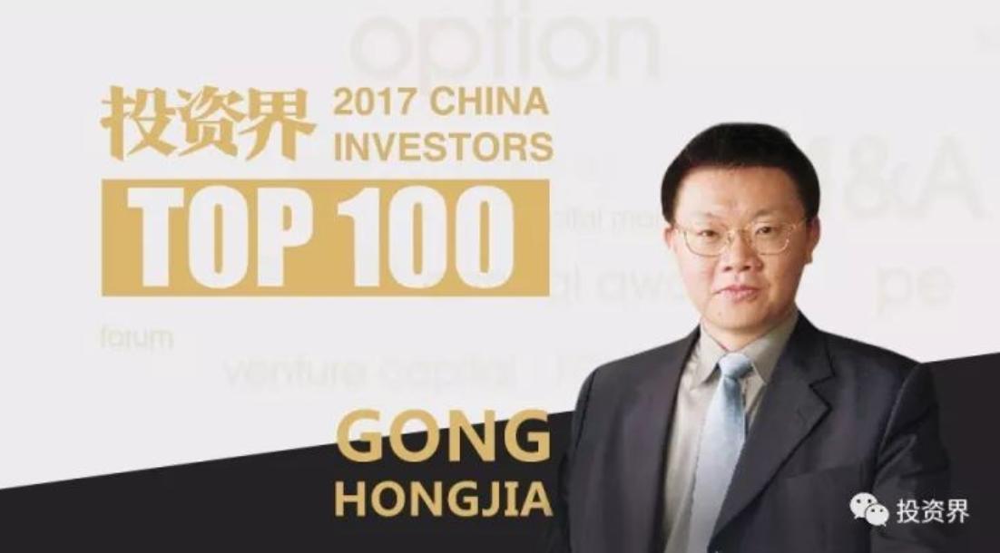

> 姓名：龚虹嘉
> 年龄：51岁
> 职位：嘉道私人资本董事长
> 代表案例：海康威视、富瀚微电子

　　在2017年中旬的一次投资人小型聚会上，大家聊起了当时颇为热门的一个话题：一个名叫李红涛的男子，两次越狱被判死刑，却凭借着“无刷电励磁电机”发明专利死里逃生，甚至依据自己越狱的经验，帮助监狱改良了管理系统，如今已被刑满释放。

　　正当大家唏嘘这段传奇经历时，龚虹嘉突然说道：“我要找到这个人，如果他想创业，我来投资！”

　　这就是超极天使、“土八路投资人”龚虹嘉，偏爱投资“冷门”项目和背景“平凡”的创业者。他有个著名的“三不”原则：**别人不想做、不愿做、不敢做的东西，才可以去做**。这一原则在他先后4次参与创业、亲自主导和参与近百起天使投资中贯彻始终，让他创办的企业成为行业头部，进行的投资获得超千倍、万倍回报。

###　一

　　1986年，曾经的高考作文满分、国家标枪三级运动员龚虹嘉，从华中工学院（现华中科技大学）计算机系毕业，他或许没有想到，不喜欢、不擅长理工科的自己会在日后成为科技创业者，而自己的校友、同学，成就了他的多笔投资神话。

　　“我的大学读书、工作、创业、做天使投资人，甚至包括娶妻，都是在一个非常窄的圈子里面进行的。几十年来，数番来来回回，我都和这几十个人发生着各种联系。人生这么多的大事都在一个专业班上完成，而且还从与班上同学合作赚得自己第一、二、三桶金。这就让常人觉得有点匪夷所思天理难容了。”

　　在清科创投基金一次年会上，龚虹嘉自称是中国“运气”最好的天使投资人，他问台下的创业者：“那么，运气来了你能不能抓住？”

　　1994年，就职于深圳一家国营单位的龚虹嘉正面临着一次创业的机遇。在他的两位领导刘俊峰和梁伟看来，这个小伙子“人品正、脑子灵”，可以作为创业合伙人。

　　于是，三人辞职下海，成立了德生收音机。

　　90年代初，受到电视毁灭性打击，全国几十家收音机厂商都在降价求生，高端品牌又长期被国外垄断，但德生从二者之间找到了一个舒适区间：

　　首先，以当时的消费水平，普通消费者很难支付百元以上的外国货；其次，我国幅员辽阔，电视机彻底颠覆收音机还有漫长的路要走；再次，在一个夕阳行业里创业，竞争者也相对较少。

　　德生收音机主打价格合理、性能稳定、外观美观、售后服务有保证的特点。通过适当推广，德生收音机很快风靡全国，在当时50元以上的收音机市场占有率超过70%。”这家看似做不成的公司，如今已经做成了中国驰名商标，产品已经远销美国、加拿大、俄罗斯、越南、缅甸、中东、欧洲等国家和地区。

###　二

　　与人生第一次创业接踵而来的，是龚虹嘉人生的第一笔上市退出的投资。1995年，3个60多岁的科学家在杭州创办了一家做“移动计费”的公司——德康通信技术公司，龚虹嘉成为其第一个投资人。

　　在今天的天使投资标准看来，他自己也觉得当年“荒唐”。“但是看到这3个老头有一点常人不具备的经验、人脉或者小成果”，他出手了。

　　经过几年发展，德康已发展成为全国最大的手机实时计费软件公司，当时，公司有6个省的手机计费系统在开发实施。正值用人之际，宁波电信局的一位领导向德康的创始人推荐了丁磊。但一心只想做互联网的丁磊觉得德康是一家电信软件公司，离他的梦想差太远，并且他坚定地认为，要投身互联网，把必须先去到当时改革开放的前沿广州、深圳。

　　几乎与丁磊在广州创立网易的同时，德康遭遇了生死危机。公司的快速发展引来了当时“杭州最牛公司”东方通信的觊觎。东信也看准了移动计费市场，时任董事长的施继清砸了3000万，“不计代价”从德康挖人。“东信就在马路对面租了1000平方米的写字楼，技术骨干和市场经理以上的人全给挖走了，文档也给带走了。”

　　然而，系统开发不能有大的闪失，否则除了会丢掉手中的合同，还会面临巨额合同违约索赔。这时，丁磊的中学同班同学张涛走入了龚虹嘉的视野。张涛是丁磊专门推荐给德康的，当时仅入职不足4个月，才华还没被竞争对手东信发觉，这给龚虹嘉留下一个绝地反击的好苗子。于是，他一夜之间将张涛提拔为公司总工程师，负责重组公司的技术团队。

　　在那场被龚虹嘉称作“哗变”的危机中，他始终与德康站在一起。即使公司领导层只剩下他和一位管市场的副总经理，他依然不惧压力、临危受命，并慧眼识人，大胆提拔了张涛，帮助公司度过了危机。

　　1998年，德康通过置换股份与田溯宁的亚信公司合并，2000年5月，亚信在美国纳斯达克挂牌上市，成为第一家赴纳斯达克上市的中概股，也是龚虹嘉人生第一次通过公司上市退出的公司。

###　　三

　　龚虹嘉认为，天使投资人首先要有一个天使般仁慈的心，真心想帮助别人，即使看到赚钱的可能性为10%，赔钱的可能性为90%，也愿意帮助他人实现梦想。与其他天使投资人相比，他还有一重身份——企业引路人，不仅收获了财务回报，也收获了创始合伙人的信任和友谊。

　　一次被投公司的年会上，龚虹嘉对公司创始人说：“这是我最后一次来参加你们年会了。”当时新一轮风险投资的款项刚到账，公司熬过了最困难的日子，他觉得是时候退出历史舞台了。

　　“最艰难的日子大概是在2007年左右”，多年后，富瀚微电子董事长杨小奇回忆道：“那时公司初创三四年的时间，总经理走了，项目经理也走了，凡此种种，项目青黄不接，资金周转不灵，不断投入人力却没有收入。”

　　在公司看不到希望的那些日子里，龚虹嘉始终信任他们，始终和他们站在一起，而度过危机后，他想交出管理权。

　　“虽然你的身价已经不太适合参加这种小公司的年会了，但我们希望你能继续参加每一次董事会和年会，直至公司上市。”杨小奇握着龚虹嘉的双手，眼含泪水：“你来了，我们心里感到踏实。”于是，龚虹嘉真的坚持每年出现在公司年会上，一直到2016年底。

　　2017年2月20日，富瀚微电子在深圳创业板上市。从200万元天使投资到公司成功上市，这家安防领域提供视频监控芯片及解决方案的公司，为龚虹嘉带来超千倍的账面回报。

###　　四

　　提及安防领域龚虹嘉的最佳投资，海康威视是绕不开的案例。凭这次投资，他获得了2万倍回报。

　　海康威视的缘起，依然是龚虹嘉的“小圈子”。海康威视的创业团队里，陈宗年和胡扬忠是龚虹嘉华中科技大的校友，有着多年数字音视频监控系统研究和实践经验，技术体系已臻完整。龚虹嘉希望能为有梦想的校友做些事情。

　　于是2001年11月，龚虹嘉出资245万元，持股49%，和陈宗年、胡扬忠所就职的国营单位～浙江海康信息技术股份有限公司共同成立杭州海康威视数字技术有限公司。彼时，视频监控行业规模很小，设备价格昂贵，主要是银行电力通信这些重点行业和要害部门使用。从事视频监控的公司并不被市场看好。而在海康威视成立的当年，美国的911事件爆发，让龚虹嘉看准了安防未来十年的兴起。

　　事实也确是如此，随着中国城镇化进程加快，房地产迎来黄金十年的繁荣，中国政府着力建设“天网工程”和“平安城市”。国外反恐形势愈加严峻，以视频监控为主的安防行业的规模和市场需求，在国内和国外都同时井喷。

　　在海康威视的头几年，龚虹嘉花了大量时间和国有股东、公司创始员工讨论公司的发展策略、产品路线、市场定位、公司治理结构、董事会运作规则，让这家具备天时的公司在日后的发展中也具备了人和。

　　得益于企业的稳步成长，2010年，海康威视登陆A股，当年龚虹嘉夫妇的账面浮盈已超百亿。如今，海康威视的市值已逾3600亿， 创造了千余项授权专利，成长为全球视频监控市场份额第一，全球安防50强第一。

　　随着股票解禁，龚虹嘉陆续从海康威视减持离场，目前仍然持有其15.12%的股份，并担任公司副董事长。

###　　五

　　自1994年起，龚虹嘉先后4次参与创业项目，亲自主导和参与的个人天使投资项目近百起，累计投资金额近10亿元人民币，行业覆盖信息技术、互联网、半导体等创新科技领域。

　　此外，在投资周期长的生命科学、环境保护等领域，龚虹嘉也逆势而为，实践着身为天使投资人的社会责任，投出了诸如目前估值高达20亿元的癌症基因组学解决方案提供商“泛生子”、专注于有机废弃物资源化利用和耕地质量提升服务的环保型高新技术企业“嘉博文”等。

　　千倍、万倍回报，让龚虹嘉在投资人的圈子里声名鹊起。他拥有让人钦羡的财富：2017年福布斯华人富豪榜，龚虹嘉及家族以净资产58亿美元排名第40名；2017胡润全球富豪榜，龚虹嘉及家族以53亿美元财富位列第305名。

　　“我一般比较少谈论怎么样赚钱，说出来让人恨。”龚虹嘉极少公开谈论自己的投资理念和逻辑，说得最多的往往是“靠风水”、“凭运气”，但他也坚信没有谁可以随随便便成功。在他身上，有着许多时下创业者和投资人不具备的企业家品格。

　　他说，**从人性层面，百分之六七十的人会高估自己，创业失败往往是创业者高估了自己的实力，常常被专业骗**。所以他的创业合伙人大多出身草根，没有海归、没有名牌大学MBA，甚至大多数没有公司的经营管理经验。这些创业者往往更务实，学习能力更强，也更容易在创业过程中迅速成长。

　　他说，当谁也不愿意再对创业团队多给一份信心、多放一分钱的时候，他坚持放了那么一点钱，最后才有了今天看到的一些成功企业。所以他坚持用自己的钱做投资，也更从容面对退出。

　　他说，优秀的创业者往往会有点偏悲观、有点焦虑、有点自虐、有点内敛。所以他自称自己虽然钱多，但生活品质最差。他需要反复与自己的内心对话、反复追问我是谁，究竟为何与众不同，才能一次次客观认识自己的能力和创业伙伴的能力，才能一次次找到“与众不同”的项目和领域。

　　对于投资，龚虹嘉有自己的方式：“我经常一次又一次用十几年的忍耐甚至是被大多数人的不理解换来几天的快乐，几天快乐之后马上陷入一个新的循环里面去。这可能是我们的命，也是一种使命，我们只能苦下去。”

>【本文为投资界原创，网页转载须在文首注明来源投资界（微信公众号ID：PEdaily2012）及作者名字。